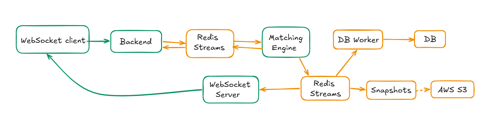

# TradeX

TradeX is a service-oriented trading system for simulated spot trading. It accepts authenticated orders over HTTP, matches them in an in-memory engine, persists durable trading records to PostgreSQL through a worker, and publishes order-book depth updates over WebSocket.

## Overview

The application separates the latency-sensitive matching path from authentication, persistence, and market-data delivery. The API validates requests and waits for a correlated engine response. The engine owns balances, order books, orders, and fills in memory. Redis Streams provide the asynchronous transport between services, while Redis string keys provide engine restart snapshots. PostgreSQL is the durable store for users, balances, orders, and fills.

## System Architecture

 

### Services and interaction

| Service | Responsibility | Interfaces |
| --- | --- | --- |
| Backend API | Express HTTP API, Zod validation, bcrypt password hashing, JWT cookie authentication, request/response correlation | HTTP on `3001`; Redis Streams `backend_to_engine` and `engine_to_backend`; PostgreSQL `Users` table |
| Engine | Single-process in-memory matching engine for limit and market orders, cancellations, balances, fills, and depth | Redis Streams |
| DB Worker | Consumes engine persistence events and upserts balances, orders, and fills using Prisma | Redis Stream `engine_to_db`; PostgreSQL |
| WebSocket Server | Consumes depth events and fans them out to subscribed sockets | WebSocket on `8080`; Redis Stream `engine_to_ws` |
| WebSocket Client | User-facing market-data client that subscribes to depth streams and displays updates of order book to connected users | WebSocket client; Backend API `/api/v1/order/depth/:asset` |
| Snapshot Worker | Uploads the Redis RDB file to Amazon S3 on a six-hour interval | Local file `engine/redis-data/dump.rdb`; S3 |


## Tech Stack and System Architecture

- **Runtime:** Bun with TypeScript.
- **API:** Node-compatible Express, cookie-parser, Zod, bcrypt, and jsonwebtoken.
- **Messaging and state:** Redis client, Redis Streams, consumer groups, and Redis RDB snapshots.
- **Database:** PostgreSQL with Prisma and `@prisma/adapter-pg`.
- **Realtime transport:** `ws` and a Bun WebSocket server.
- **Object storage:** AWS SDK S3 client in the snapshot worker.
- **Testing:** Bun test runner with unit and integration-style engine tests.

## Key Features

- Signup and signin with bcrypt-hashed passwords.
- JWT authentication stored in an HTTP-only `jwt` cookie with a 72-hour lifetime.
- Authenticated order creation for SOL, BTC, and ETH.
- Limit and market order handling with available/locked balance accounting.
- In-memory price-level order books with bid/ask depth queries.
- Order matching, partial fills, fills, self-trade avoidance, and cancellation.
- Correlated asynchronous API requests over Redis Streams.
- Durable balance, order, and fill writes through a dedicated Prisma DB worker.
- Redis-backed engine recovery snapshots.
- Redis RDB backup upload to S3 via the snapshot worker.
- WebSocket subscriptions for `depth.SOL`, `depth.BTC`, and `depth.ETH`.
- Headless WebSocket client (`ws-client`) that can be used to connect, subscribe, and view live order-book depth.

### Redis Streams and state

- `backend_to_engine`: API commands. Each entry contains `ToEngineStringified`, including `function`, `payload`, `userId`, and a numeric `Identifier`.
- `engine_to_backend`: engine responses. Each entry contains `ToBackendStringified`, including `ok`, `Identifier`, and either `data` or `error`. The API resolves the waiting HTTP request by matching `Identifier`.
- `engine_to_db`: persistence events emitted by the engine. The DB worker consumes `data` containing the order, balance snapshots, related orders, fills, and `createOrCancel` operation.
- `engine_to_ws`: market-depth events. Each entry contains `update`, with a stream name such as `depth.BTC`, bid/ask levels, and `lastUpdatedId`.
- Engine snapshot keys: `engine:lastId`, `engine:fills`, `engine:orders`, `engine:orderbook`, and `engine:balances`.

The API and WebSocket service create Redis consumer groups dynamically and consume new messages with `XREADGROUP`. The engine and DB worker use sequential `XREAD` loops. Redis clients use the default connection created by the `redis` package, so local development expects Redis at `localhost:6379` unless the runtime environment configures another default connection.

### PostgreSQL persistence

The backend schema contains `Users`. The DB worker schema contains:

- `Balances`: one row per user, with available and locked USD, SOL, BTC, and ETH quantities.
- `Orders`: order identity, user, market, side, type, price, quantity, fill quantity, status, and timestamp.
- `Fills`: execution quantity, price, asset, side, buy/sell order references, user, and timestamp.

The matching engine is the source of truth for live state. PostgreSQL is eventually updated by the DB worker and is not queried for order-book matching.

## Folder Structure

```text
TradeX/
├── backend/
│   ├── prisma/                 # Users schema and migrations
│   └── src/
│       ├── controllers/        # Auth and order HTTP handlers
│       ├── middlewares/        # JWT cookie authentication
│       ├── routes/             # Express route registration
│       └── utils/              # Redis request/response correlation
├── engine/
│   ├── redis-data/             # Redis RDB output directory
│   └── src/
│       ├── Engine/             # Command dispatcher
│       ├── Options/            # Create, cancel, query, and depth operations
│       ├── snapshot/            # Redis state persistence and restore
│       ├── Types/              # In-memory order, fill, and balance types
│       └── utils/              # DB/WS event publishing and state
├── db worker/
│   ├── prisma/                 # Balances, Orders, Fills schema and migrations
│   └── src/                    # Redis consumer and Prisma persistence
├── ws/
│   └── src/                    # WebSocket server and stream consumer
├── ws-client/
│   └── src/                    # Headless WebSocket market-data client for users
├── snapshot worker/            # Periodic RDB-to-S3 uploader
└── tests/                      # Validation, engine, and integration tests
```

## API Reference

### Authentication

| Method | Path | Purpose |
| --- | --- | --- |
| `POST` | `/auth/v1/signup` | Validate email/password, create a user, and set the JWT cookie. |
| `POST` | `/auth/v1/signin` | Authenticate credentials and set the JWT cookie. |

### Orders and market data

| Method | Path | Purpose |
| --- | --- | --- |
| `POST` | `/api/v1/order/buysell` | Create a validated limit or market buy/sell order and wait for the engine result. |
| `GET` | `/api/v1/order/balance` | Return the authenticated user balance from the engine. |
| `DELETE` | `/api/v1/order/:orderId` | Cancel an open/partially filled limit order owned by the authenticated user. |
| `GET` | `/api/v1/order/:orderId` | Retrieve an order owned by the authenticated user. |
| `GET` | `/api/v1/order/depth/:asset` | Return bid/ask levels for `SOL`, `BTC`, or `ETH`. |

Example order body:

```json
{
  "stockName": "SOL",
  "type": "limit",
  "side": "buy",
  "price": 100,
  "quantity": 2
}
```

For market orders, `price` may be `null`. Limit orders require a positive price and all quantities must be positive integers.

### WebSocket reference

Connect to `ws://localhost:8080` and send:

```json
{
  "method": "SUBSCRIBE",
  "params": ["depth.BTC"]
}
```

Valid subscription names are `depth.SOL`, `depth.BTC`, and `depth.ETH`. Updates contain `asks` and `bids` arrays of `[price, quantity]` pairs. Send the same shape with `"method": "UNSUBSCRIBE"` to remove a subscription.
